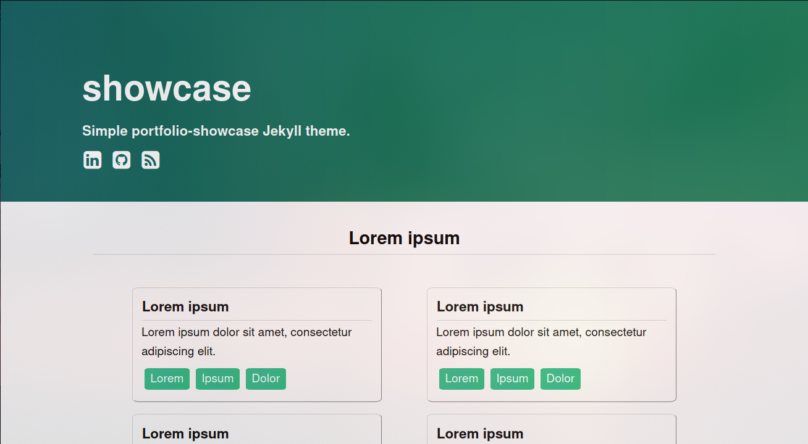

# [showcase](https://vllur.github.io/showcase/) 

`showcase` is a modern website for presenting your projects.

A live demo is available [here](https://vllur.github.io/showcase/).

## Features:
- no dependencies
- can be hosted easily on [Github Pages](https://pages.github.com/)
- modern
- responsive
- simplistic
- really fast (100 points on PageSpeed Insights!)

## How to:
- do easy deploy:
  1. Fork this repo
  1. Change `baseurl` in `_config.yml` to `/`
  1. Change its name to [nickname].github.io
  1. Visit [nickname].github.io
- customize your projects:
  - These are simple list items in `index.html` file - you can add, remove, and edit them there
- customize colours and gradients:
  - All of the colours are in `_sass/variables.scss` file. Editing them will edit colours site-wide.

## Licensing:
### Project
This project is licensed under the MIT license.

### Font Awesome
   Copyright (C) 2016 by Dave Gandy, SIL license

   [fortawesome.com](http://fortawesome.github.com/Font-Awesome/)
